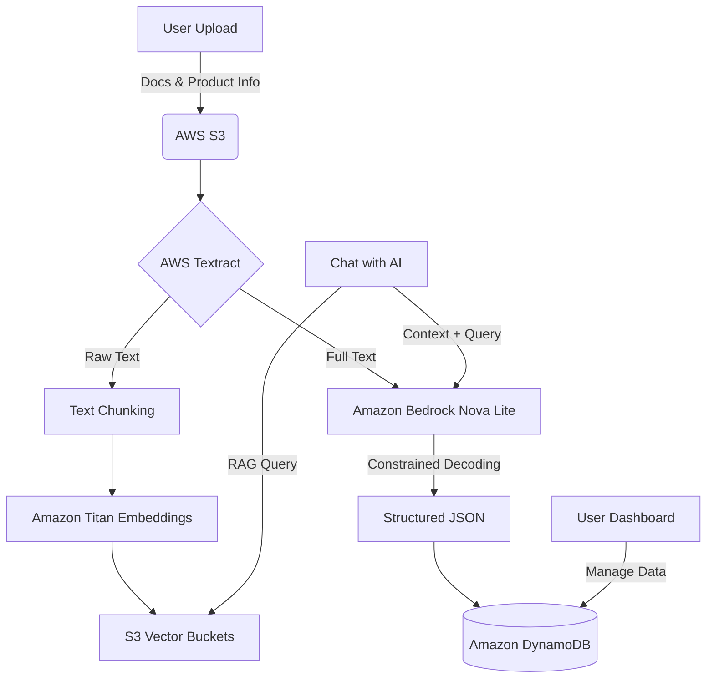

# 🦖 DocsDrive

**DocsDrive** is an intelligent bill and document management platform that leverages state-of-the-art AWS AI services to extract, organize, and interact with your appliance information. Never lose track of a warranty or manual again!

---

## 🚀 The Flow

1.  **Upload**: Users upload bills, AMC (Annual Maintenance Contract) documents, and product images/names.
2.  **Context**: Product metadata provides context to the LLM, helping it pinpoint relevant information within large documents.
3.  **Extraction (Backend)**: 
    - Documents are uploaded to **AWS S3**.
    - **AWS Textract** extracts raw text from the documents.
    - **Amazon Titan Embedding** generate vector embeddings from extracted text chunks.
    - Embeddings are stored in **S3 Vector Buckets**.
4.  **Structured Analysis**:
    - Extracted text is concatenated and fed into **Amazon Bedrock (Nova Lite)**.
    - Uses **Constrained Decoding** to output structured JSON data.
    - Extracted information (Brand, Model, Warranty Dates, Price, etc.) is stored in **Amazon DynamoDB**.
5.  **Interaction**:
    - **View & Edit**: Users can manage the extracted data directly in the dashboard.
    - **RAG Chat**: A dedicated **"Chat with AI"** feature for each bill allows users to ask questions about their documents (e.g., "What does the warranty cover?") using a **Retrieval-Augmented Generation (RAG)** system.

---

## 🛠️ Architecture



---

## 🔥 Key Features

-   **Intelligent Extraction**: Automated data entry from messy bills using AWS Textract & Bedrock.
-   **Context-Aware OCR**: High accuracy achieved by combining visual context with document text.
-   **RAG-Powered Conversations**: Real-time WebSocket-based chat to interact with your document data.
-   **Smart Storage**: Serverless architecture for high scalability and security.
-   **Premium UI**: A sleek, modern dashboard built with React and Tailwind CSS.

---

## 💻 Tech Stack

-   **Frontend**: React (Vite), TypeScript, Tailwind CSS, Wouter, TanStack Query.
-   **Backend**: AWS Lambda, API Gateway, WebSocket API.
-   **AI Services**: AWS Textract, Amazon Bedrock (Nova Lite & Titan Embeddings).
-   **Storage**: Amazon S3, Amazon DynamoDB.
-   **Auth**: Amazon Cognito via AWS Amplify.

---

## ⚙️ Setup & Installation

Follow these steps to get the project running locally:

1.  **Clone the repository**:
    ```bash
    git clone https://github.com/goyal-Dushi/docsdrive.git
    cd docsdrive
    ```

2.  **Install dependencies**:
    ```bash
    npm install
    ```

3.  **Environment Variables**:
    Create a `.env` file in the root directory and add your AWS configuration:
    ```env
    VITE_AWSREGION=your_region
    VITE_COGNITO_USERPOOLID=your_userpool_id
    VITE_COGNITO_CLIENTID=your_client_id
    VITE_API_GATEWAY_DOMAIN_DEV=your_api_url
    VITE_WS_URL=your_websocket_url
    VITE_CLOUDFRONT_DOMAIN=your_cloudfront_url
    ```

4.  **Run the development server**:
    ```bash
    npm run dev
    ```

---

## 🤝 Contributing

We welcome contributions! To maintain a smooth workflow, please follow these steps:

1.  **Found a bug or have a feature idea?**
    Please start by creating a new **Topic/Discussion** in the repository.
2.  **Explain your proposal**: 
    Detail the enhancement or the issue you've identified. 
3.  **Wait for assignment**:
    Once the team reviews your proposal and assigns it to you, you can start working on it.
4.  **Submit a PR**:
    Ensure your code follows the existing formatting (Biome) and includes clear documentation for any changes.

---

Built with ❤️ by the DocsDrive Team.
